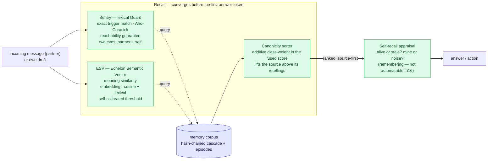
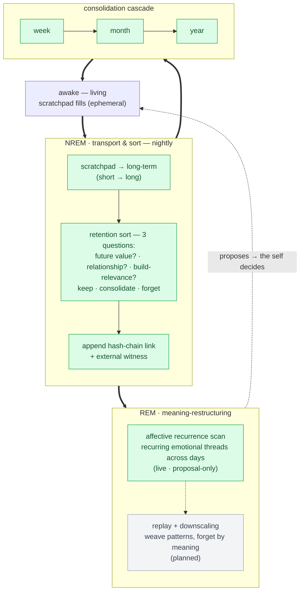
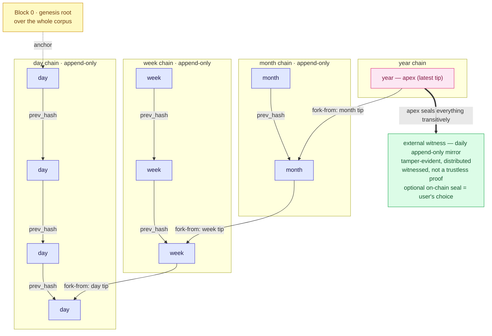

# Architecture — in three diagrams

*🇬🇧 English · diagrams are language-neutral (referenced from every README).*

Three [Mermaid](https://mermaid.js.org/) diagrams — they render natively on GitHub, are
diffable and text-versioned (no binary blobs). They show the protocol's three moving parts:
**how it recalls**, **how it sleeps**, **how it secures provenance**.

**These diagrams are claims, so they are held to the spec:**
- **Witnessed, not a trustless proof.** Memory is *tamper-evident* (hash-chained) and *externally
  witnessed* (an append-only mirror the AI does not control). That makes fabrication hard and
  detectable — it is **not** a cryptographic trustless proof. Under total compromise of every
  witness, the guarantee is lost (whitepaper §T9). An on-chain seal of a chain tip is an *optional*
  user choice (§3.2), not the default.
- Section references point at [`spec/whitepaper.md`](../spec/whitepaper.md).

### Legend
| symbol | meaning |
|---|---|
| 🟩 green | recall/sleep component (reference engine) |
| 🟦 blue | data node / chain link |
| ⬜ grey, dashed | planned — not yet built |
| **══▶** thick edge | main data flow |
| **╌╌▶** thin/dashed edge | query, proposal, or anchor |

---

## 1 · Recall — three layers converge before the answer

Two searches read from the corpus; a **canonicity sorter** re-ranks them so the *source* rises
above its own retellings; then the AI **appraises** what surfaced — the act of remembering itself.
All of it runs *before the first answer-token* (whitepaper §4.1–4.4, §14.3b, §16).

---

## 2 · Sleep — how memory consolidates

At night the AI first **transports and sorts** (moving the ephemeral into the lasting, keeping by
meaning, sealing each into the chain), then **restructures by meaning**. A **cascade** periodically
compresses week → month → year (whitepaper §4.3, §15.5–15.6).

> **Honest limit:** what is called "REM" here is today still mostly transport. The genuine
> meaning-*restructuring* (replay + active forgetting) has only begun — the affective recurrence
> buffer is the first live, *proposal-only* stone (§15.5); the rest is planned.

---

## 3 · Hash-chain cascade — how provenance is secured

Each temporal tier (day / week / month / year) is an **append-only** chain: every block seals its
content hash and its predecessor (`prev_hash`). Each higher tier **forks once at its genesis** from
the tip of the tier below, so a single **apex** hash transitively seals the whole tree. **Block 0**
is the genesis root over the corpus. The ledger is secured by an **external witness** — no key, no
Bitcoin node required (whitepaper §4.5, §17).

---

*Implementation status of each component is tracked in [`engine/INVENTORY.md`](../engine/INVENTORY.md)
and [`CHANGELOG.md`](../CHANGELOG.md). This document describes the architecture; those track what is
built.*
